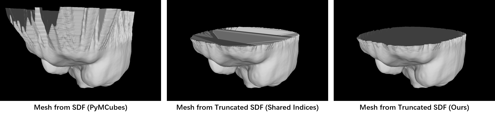

# PyTMCubes

This is a modified version of [PyMCubes](https://github.com/pmneila/PyMCubes), which implements marching cube algorithm to extract mesh from SDF or binary mask volume.

The main difference between PyTMCubes (this repo) and original version is that we support to compute non-water-tight mesh from truncated signed distance functions. Specifically:

- We add a `truncated_value` parameter in `marching_cube` function, a cube will be ignored during the mesh calculation when one of its eight corners' absolute sdf values is larger than `truncated_value` (if `truncated_value` is set to be larger than 0). 

- The original PyMCubes provides a shared indexing strategy in marching cube process, which means they would re-use the computed vertices in triangulation. This may lead to degenerated faces when there are ignored voxels. We extract triangles for all cubes **separately** and perform a **clustering decimation** (in `mcubes/voxel_decimate`) to remove duplicated vertices.

The usage are almost the same except for an additional `truncated_value` (by default the volume will not be truncated).

```python

```

The following figures give an intuitive illustration:



## Installation
```
python setup.py install
```

## Others
This project is used as a pre-processing tool for our VCG project.
